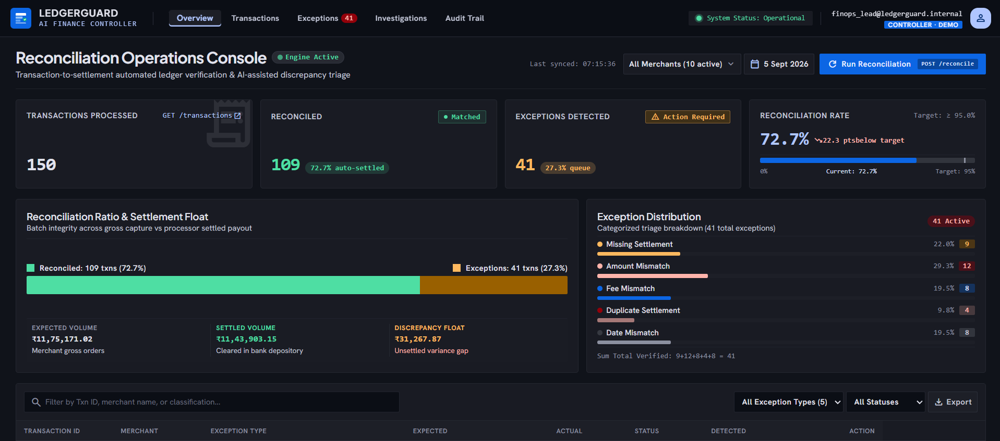
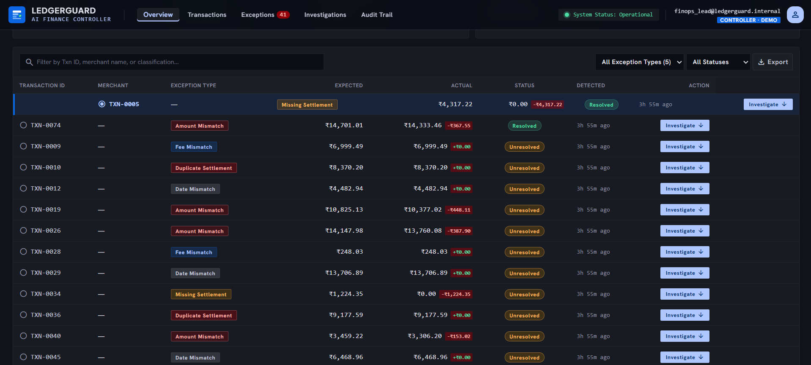
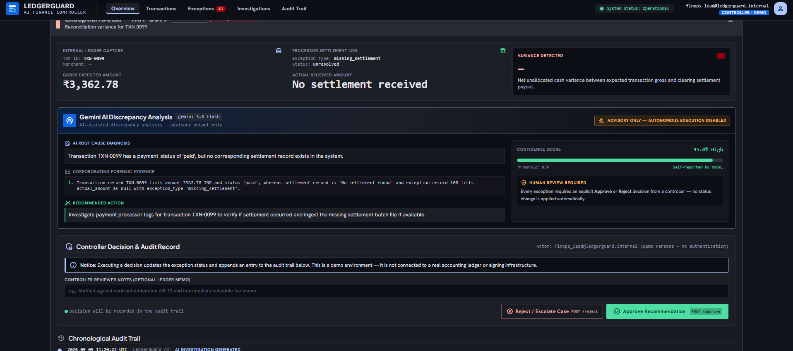
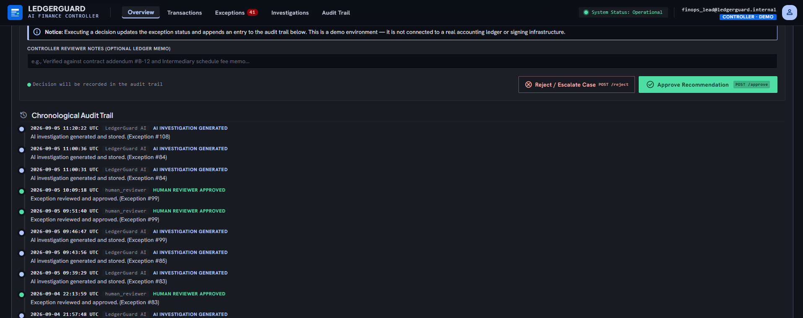

# LedgerGuard — AI Finance Controller

**Track:** AI Finance Controller (Razorpay AI Builder Buildathon)

LedgerGuard automates reconciliation between payment transactions and settlement
records, classifies discrepancies with a deterministic rules engine, uses an LLM
(Gemini) to investigate flagged exceptions and propose corrective actions, and
routes every financial decision through an explicit human approve/reject step
with an audit trail. It is a demo / MVP submission, not a production system —
see [Known Limitations](#known-limitations) for an honest accounting of what is
and isn't implemented.

---

## Product Screenshots

### Reconciliation Dashboard



*LedgerGuard dashboard showing reconciliation KPIs, exception distribution, and settlement overview.*

### Workflow in Action



*Exception queue showing transaction-level reconciliation discrepancies and investigation actions.*



*AI-assisted exception investigation showing root cause, evidence, recommendation, confidence, and mandatory human review.*



*Human review and audit trail showing investigation and decision events.*

> The audit trail screenshot above reflects the demo/test state from the
> [Live AI Verification](#live-ai-verification) run (exception #84) — it is a
> screenshot of a demo activity log, not production compliance evidence or an
> immutable audit trail.

---

## Demo at a Glance

```
Reconcile → Detect Exception → Investigate with AI → Human Review → Audit
```

Every reconciliation pass matches transactions against settlements, flags
anything that doesn't line up, lets a reviewer trigger an AI investigation for
context, and requires an explicit human approve/reject before an exception is
considered resolved — with each step written to the audit log. See
[Demo Flow](#demo-flow-5-minutes) for the full walkthrough.

---

## Problem

Manual financial reconciliation — matching what a merchant was charged against
what the payment processor actually settled — is slow, repetitive, and
error-prone at scale. Discrepancies (missed settlements, fee drift, timing
mismatches, duplicates) need to be found quickly, explained in plain language,
and routed to a human for a final decision, with a record of what happened and
why.

## What LedgerGuard Does

1. **Matches** every transaction against its settlement record using a
   deterministic, auditable rules engine.
2. **Classifies** any discrepancy into a specific exception type.
3. **Investigates** each exception with Gemini, which explains the likely root
   cause and evidence using only the transaction/settlement data it's given.
4. **Requires a human decision** (approve/reject) before any exception is
   considered resolved — the AI never resolves anything on its own.
5. **Records** every AI investigation, AI failure, and human decision to an
   audit log.

---

## Core Workflow

```
User → Frontend → FastAPI → Deterministic Reconciliation Engine → Supabase
                                           │
                                           ▼
                                 Structured Exceptions
                                           │
                                           ▼
                                       Gemini AI
                                           │
                                           ▼
                             Investigation + Evidence
                                           │
                                           ▼
                             Human Review / Decision
                                           │
                                           ▼
                                      Audit Log
```

---

## Architecture: Why Deterministic Matching Is Separate From the LLM

This is the central design decision in LedgerGuard, and it's deliberate:

- **The reconciliation engine (`reconciliation.py`) is a pure, deterministic
  function** — no network calls, no randomness, no model involved. Given the
  same transaction and settlement records, it always produces the same
  classification. That makes it predictable, unit-testable, and fully
  auditable: you can point at any exception and explain in one sentence
  exactly why the rule fired.
- **Gemini is never asked to decide whether something matches.** By the time
  the AI sees an exception, the deterministic engine has already classified it
  (e.g. `fee_mismatch`). Gemini's job is narrower and better suited to an LLM:
  explain the likely root cause, cite the specific evidence, and recommend a
  corrective action — in other words, investigation and explanation, not
  primary financial matching.
- **Gemini is constrained to return structured JSON** (`root_cause`,
  `evidence`, `recommended_action`, `confidence`, `requires_human_review`),
  which is what makes its output safe to store, display, and act on
  programmatically instead of being a free-text blob a human has to parse.
- **A human must explicitly approve or reject every exception.** No status
  change happens automatically — not on a successful AI investigation, and
  certainly not on a failed one.
- **Every AI investigation, AI failure, and human decision is written to an
  audit log**, so there's a record of what the AI said and what a human
  ultimately decided.
- **If Gemini fails, LedgerGuard does not fabricate a result.** See below.

---

## Deterministic Reconciliation Rules

Implemented in `backend/reconciliation.py` as a pure function
(`reconcile_transactions`). Rules are evaluated in order per transaction; the
first match wins.

| Order | Condition | Result |
|---|---|---|
| 1 | No settlement record found for the transaction | `missing_settlement` |
| 2 | More than one settlement record found | `duplicate_settlement` |
| 3 | `\|expected amount − actual amount\| > ₹0.01` | `amount_mismatch` |
| 4 | `\|expected fee (2% of amount) − actual fee\| > ₹0.01` | `fee_mismatch` |
| 5 | Settlement date is more than 5 days after the transaction date | `date_mismatch` |
| 6 | None of the above | `reconciled` |

> **Note:** the 2% fee rate and 5-day window are LedgerGuard's own synthetic
> demo business rules, chosen to build a testable dataset around. They are
> **not** Razorpay's actual production reconciliation policies, and shouldn't
> be read as such.

---

## AI Investigation

`backend/ai_investigator.py` sends the flagged exception, its transaction
record, and its settlement record (if any) to Gemini, instructed to explain
the exception using **only** the supplied data — not to invent information.

Expected output (strict JSON):

| Field | Purpose |
|---|---|
| `root_cause` | Short explanation of why the exception likely occurred |
| `evidence` | Specific evidence from the transaction/settlement records |
| `recommended_action` | Practical corrective action |
| `confidence` | Model's self-reported confidence, 0–1 |
| `requires_human_review` | Always required for financial actions |

The AI's output is advisory only. It is displayed to a reviewer alongside the
raw transaction/settlement comparison — it never changes an exception's status
by itself.

### AI Failure Handling

If Gemini is unavailable, times out, hits a rate limit, or returns malformed
JSON that can't be parsed into the expected fields, `POST
/exceptions/{id}/investigate` handles it explicitly rather than letting the
error propagate as a generic server error:

- **No fabricated investigation is stored** — no `ai_investigations` row is
  written.
- **The exception remains unresolved** — its status is never touched by a
  failed investigation, so it stays visible in the review queue.
- **An `ai_investigation_failed` audit event is recorded**, including the
  exception ID and a concise (secret-redacted) failure reason.
- **The API returns HTTP 503** with a structured body:
  ```json
  { "error": "AI investigation unavailable", "message": "Gemini investigation failed. Human review is required." }
  ```
- **Nothing is auto-approved or auto-rejected.** A failed AI call simply means
  a human has to review the exception without an AI recommendation.

### Live AI Verification

A real end-to-end run (no mocks) was performed against a live unresolved
exception — **ID 84 (`TXN-0009`, `fee_mismatch`)** — exercising the full path:
FastAPI → `ai_investigator.py` → Gemini → Supabase → audit log. Verified:

- FastAPI returned **HTTP 200**
- The real Gemini call succeeded and returned valid structured JSON
- An `ai_investigations` row was written to Supabase
- An `ai_investigation` audit event was written
- The exception remained `unresolved` throughout
- No API keys or secrets appeared anywhere in the captured output

**Transparency note:** during this verification, a client-side connection drop
caused the investigate request to appear to fail locally even though the
server had already completed it. A second call was made to get a clean
response, and both had in fact succeeded server-side. As a result, exception
84 currently has two legitimate `ai_investigations` rows and two
`ai_investigation` audit rows instead of one — a test artifact from that
session, not a bug in the endpoint or the failure-handling logic (which was
verified separately, without hitting Gemini).

---

## Human Review & Audit Trail

Every exception requires an explicit decision:

- `POST /exceptions/{id}/approve` — marks the exception `resolved`, logs an
  `approved` audit event (`actor: human_reviewer`).
- `POST /exceptions/{id}/reject` — marks the exception `rejected`, logs a
  `rejected` audit event (`actor: human_reviewer`).

The audit log (`GET /audit-logs`) currently captures four event types:
`ai_investigation`, `ai_investigation_failed`, `approved`, `rejected`. It is a
demo-grade activity log, not an immutable or compliance-grade ledger — see
[Known Limitations](#known-limitations).

---

## Synthetic Dataset

Generated deterministically by `backend/generate_data.py` (`random.seed(42)`)
and seeded into Supabase:

- 150 synthetic transactions
- 145 settlement records
- 10 merchants (Amazon, Flipkart, Swiggy, Zomato, Myntra, Uber, BookMyShow,
  Croma, BigBasket, MakeMyTrip)
- Transaction dates spread across August 2026
- Six weighted scenarios (exact match, amount mismatch, missing settlement,
  date mismatch, duplicate settlement, fee mismatch) constructed so each one
  lands unambiguously in exactly one reconciliation outcome

**Current clean reconciliation baseline** (from `GET /dashboard` against this
dataset):

| Metric | Value |
|---|---|
| Total transactions | 150 |
| Reconciled | 109 |
| Exceptions | 41 |
| Reconciliation rate | 72.67% |
| Expected transaction volume | ₹1,175,171.02 |
| Settled volume | ₹1,143,903.15 |
| Discrepancy float | ₹31,267.87 |

Exception breakdown:

| Exception type | Count |
|---|---|
| missing_settlement | 9 |
| fee_mismatch | 8 |
| duplicate_settlement | 4 |
| date_mismatch | 8 |
| amount_mismatch | 12 |

---

## Evaluation

`backend/eval_reconciliation.py` is an independent, dependency-free evaluation
script. It reproduces the same deterministic dataset generation in memory
(same seed, same scenario logic as `generate_data.py`), records the
ground-truth label for each transaction from the scenario *before*
`reconcile_transactions()` is ever called, then compares the engine's actual
output against that ground truth.

**Verified result (150 synthetic transactions):**

| Metric | Result |
|---|---|
| Correctly classified | 150 / 150 |
| Classification accuracy | 100.00% |
| Mismatches | 0 |
| Per-class precision / recall | 100% for every class |
| Confusion matrix | Perfectly diagonal |

Run it yourself:

```bash
cd backend
python eval_reconciliation.py
```

No Supabase or Gemini access is required — it runs entirely in memory using
only the Python standard library plus `reconciliation.py`.

> **Caveat:** this evaluates implementation correctness against known
> synthetic scenarios — it confirms the engine correctly implements the rules
> it was designed around. It does **not** establish real-world financial
> accuracy, and it does not validate that the 2% fee / 5-day thresholds are
> appropriate for a production system. The synthetic generator was built using
> the same scenario definitions as the reconciliation engine, so a passing
> result demonstrates correctness of implementation, not independent
> real-world validation.

**Performance (one-off local microbenchmark, not a committed script):** in a
single local run, the pure `reconcile_transactions()` function processed the
150-record in-memory dataset in an average of 0.56 ms per call (10 timed runs
after 1 warm-up, `time.perf_counter()`), or roughly 267,000 calls/sec at that
record count. This measures only in-process CPU time for the matching logic —
it says nothing about end-to-end API latency, Supabase I/O, Gemini latency, or
production throughput, and there is no reproducible benchmark script checked
into this repository.

---

## Tech Stack

- **Backend:** Python, FastAPI
- **Database:** Supabase (PostgreSQL)
- **AI:** Gemini API
- **Frontend:** HTML, Tailwind CSS (CDN), vanilla JavaScript — no build step

---

## Repository Structure

```
ledgerguard-ai-finance-controller/
├── README.md
├── .gitignore
├── backend/
│   ├── main.py                   # FastAPI app — all HTTP endpoints
│   ├── reconciliation.py         # Deterministic reconciliation engine
│   ├── ai_investigator.py        # Gemini investigation wrapper
│   ├── eval_reconciliation.py    # Independent accuracy evaluation (stdlib only)
│   ├── generate_data.py          # Synthetic dataset generator (seeds Supabase)
│   ├── run_reconciliation.py     # Standalone CLI reconciliation runner
│   ├── investigate_exception.py  # Standalone CLI: investigate one exception
│   ├── test_ai.py                # Ad hoc script: single Gemini call smoke check
│   ├── test_reconciliation.py    # Ad hoc script: reconciliation summary vs. live data
│   └── .env                      # Local secrets — gitignored, not committed
└── frontend/
    └── index.html                # Single-file operations dashboard
```

---

## API Endpoints

| Method | Path | Description |
|---|---|---|
| `GET` | `/` | Liveness message |
| `GET` | `/health` | Health check |
| `GET` | `/dashboard` | Aggregate KPIs (totals, reconciliation rate, volumes, exception breakdown) |
| `GET` | `/transactions` | All transactions |
| `GET` | `/exceptions` | All exceptions |
| `GET` | `/investigations` | All stored AI investigations |
| `POST` | `/reconcile` | Re-runs reconciliation and rebuilds exception state |
| `POST` | `/exceptions/{id}/investigate` | Runs the Gemini investigation for one exception |
| `POST` | `/exceptions/{id}/approve` | Marks an exception resolved (human decision) |
| `POST` | `/exceptions/{id}/reject` | Marks an exception rejected (human decision) |
| `GET` | `/audit-logs` | Full audit trail |

---

## Running Locally

### Environment Variables

Create `backend/.env` with (no values shown here — use your own):

```
SUPABASE_URL=
SUPABASE_KEY=
GEMINI_API_KEY=
```

### Backend

```powershell
cd backend
.\venv\Scripts\Activate.ps1
uvicorn main:app --reload
```

Backend API: `http://127.0.0.1:8000`

### Frontend

```bash
cd frontend
python -m http.server 8080
```

Frontend: `http://localhost:8080`

---

## Demo Flow (~5 minutes)

1. Open the dashboard.
2. Show the reconciliation KPIs (total transactions, reconciled, exceptions,
   reconciliation rate).
3. Show the exception queue and its type/status breakdown.
4. Select an exception from the queue.
5. Run the AI investigation on it.
6. Walk through the root cause, evidence, recommended action, and confidence
   score Gemini returned.
7. Point out the explicit "human review required" indicator — the AI never
   resolves anything by itself.
8. Approve or reject the exception as the reviewer.
9. Show the resulting entry in the audit trail.
10. Explain the core design choice: a deterministic engine decides *what* the
    exception is; the LLM only explains *why*, using structured JSON.
11. Briefly describe (or demonstrate, if convenient) what happens when the AI
    call fails — a clear 503, an `ai_investigation_failed` audit event, and
    the exception staying open for a human, with no fabricated result.
12. Close with the evaluation results (100% classification accuracy against
    known synthetic scenarios) and the limitations below — framed honestly as
    an MVP, not a finished production system.

---

## Known Limitations

- **No authentication, authorization, or role-based access control.** Any
  client that can reach the API can call every endpoint, including
  approve/reject.
- **Database access is configured for MVP/demo use**, not production-grade
  security.
- **`POST /reconcile` clears and rebuilds** the `exceptions`,
  `ai_investigations`, and `audit_logs` tables each time it runs — the audit
  trail is not append-only or immutable, and should not be described as
  compliance-grade.
- **Frontend pagination controls are not functional** (always rendered as a
  single disabled page).
- **The CSV export button is not wired up.**
- **The "Transactions" navigation item currently scrolls to the same
  exception workspace as "Exceptions"** rather than opening a separate,
  full transaction list view.
- **Synthetic dataset only** — no production or real merchant data has been
  used or validated against.
- **The 2% fee and 5-day thresholds are demo business rules**, not validated
  production financial policy.
- **AI investigation availability depends on Gemini** — if the API is down or
  rate-limited, investigations are simply unavailable until it recovers
  (handled gracefully, per above, but still a dependency).
- **No claim of production-scale performance.** The only performance number
  measured is a local microbenchmark of the pure matching function, not of
  the system end-to-end.

This is a buildathon MVP: it demonstrates the architecture and the
deterministic/AI separation clearly, but it is not production-ready as-is.

---

## Engineering Lessons

- **Constrain AI output to structured JSON.** Free-text model output isn't
  safe to store or act on programmatically; a fixed schema
  (`root_cause`/`evidence`/`recommended_action`/`confidence`/`requires_human_review`)
  is what makes the investigation usable by the rest of the system.
- **AI failures must not produce fabricated results.** A timeout, rate limit,
  or malformed response has to be treated as "no investigation available,"
  never silently turned into a plausible-looking but made-up answer.
- **Failed AI investigations are worth recording separately** from successful
  ones (`ai_investigation_failed` vs. `ai_investigation`) — this keeps the
  audit trail honest about what the AI actually did or didn't do.
- **Deterministic rules should own the primary financial decision.** Using an
  LLM to decide whether two records match would make the core reconciliation
  logic non-reproducible and hard to audit; keeping that decision in a pure
  function and reserving the LLM for explanation keeps the system predictable.
- **Human review is the final control for financial actions**, regardless of
  how confident the AI's output is.
